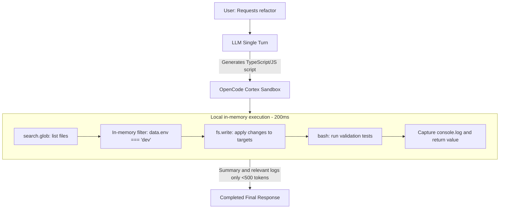

# Technical Architecture: OpenCode Cortex Mode

> **Theoretical and Practical Foundation:** Inspired by the **DeepSeek Harness (dsh)** and the **Programmatic Tool Calling / Code Mode Orchestration** paradigm.

---

## 1. The Core Problem: "Chat-and-Wait" vs "Code Mode"

### 1.1 The Traditional Model (Chat-and-Wait / Native Tool Calling)

In the conventional AI agent paradigm (OpenAI Function Calling, Anthropic Tool Use, and OpenCode Standard Mode), every action is atomic and mediated by a new inference round with the model:

```
[User] "Refactor all dev ports in the configs"
  |
  +-> [Turn 1] LLM emits: {"tool": "glob", "pattern": "**/*.json"}
  |     +-> Environment lists 300 files --> +3,000 tokens in context --> 10s wait
  |
  +-> [Turn 2] LLM analyzes 300 files and emits: {"tool": "grep", "query": "development"}
  |     +-> Environment returns 40 lines --> +2,000 tokens in context --> 12s wait
  |
  +-> [Turn 3] LLM emits: {"tool": "read", "path": "packages/api/config/dev.json"}
  |     +-> Environment returns the file --> +1,500 tokens in context --> 8s wait
  |
  +-> [Turn 4] LLM emits: {"tool": "edit", "path": "...", "old": "3000", "new": "8080"}
  |     +-> Environment applies the edit --> +500 tokens in context --> 8s wait
  |
  +-> [Turn 5] LLM emits: {"tool": "bash", "command": "npm test"}
  |     +-> Environment runs tests --> +2,500 tokens in context --> 15s wait
  |
  +-> [Turn 6] Final LLM response
```

#### Cost and Bottlenecks of the Traditional Model

1. **High Cumulative Latency:** Five to six network roundtrips to the LLM produce 45 to 90 seconds of idle waiting.
2. **Context and Billing Explosion:** Intermediate outputs (300 file names, test logs) enter the conversation memory and are re-sent and billed in **every subsequent turn**.
3. **No Control Structures:** The model cannot run a simple `if (x) { ... } else { ... }` or a `for` loop without delegating each iteration to a network roundtrip.

### 1.2 The Code Mode Architecture (DeepSeek Harness)

In **Code Mode**, the agent receives a single transport tool (`code_mode` / `dsh_exec`) and a rich **TypeScript/JavaScript SDK** injected into its execution environment:



#### Gains Achieved

* **Single-Turn Execution:** From 5-10 turns down to **1 turn**.
* **Zero Context Pollution:** 300 file names and raw data are processed in the local Node/Bun memory and **never enter the LLM token history**.
* **80-90% Token Savings:** The LLM context stays lean and clean.
* **Extreme Speed:** Local execution takes between 50ms and 400ms.

---

## 2. Critical Analysis of the Original DeepSeek Harness (dsh)

During the reverse engineering and study of the `deepseek-harness` components (`packages/core/tools/src/code-mode.ts`, `packages/code-runtime/`), we identified strengths and gaps that this plugin improves upon:

| Component | Original DeepSeek Harness | OpenCode Code Mode Implementation |
|---|---|---|
| **TypeScript Transpilation** | Depends on external Node Worker runtime | **Dual Engine:** Native transpilation in Bun (C++ via `Bun.Transpiler`) with an intelligent Node.js fallback that strips types without heavy dependencies. |
| **Output Spill Protection** | Simple linear truncation | **Smart Head-and-Tail Truncator:** Preserves the first 80 and last 50 log lines with an explicit marker for omitted lines and token savings estimation. |
| **Cross-Turn Persistence** | Stateless per code execution | **Session State Store (`state`):** Persistent per-session global object for reusing cached data between prompts. |
| **Shell Integration** | Generic execution | **Cross-Platform Shell Watchdog (`$`, `bash`):** Native and transparent support for PowerShell on Windows and Bash/Sh on Linux/macOS, with timeout and buffer protection. |
| **Workspace Integration** | Cordis isolation | **Native OpenCode (`@opencode-ai/plugin`):** Drop-in at `.config/opencode/plugin/code_mode.js`, respecting `context.directory`, `worktree`, and `context.abort`. |

---

## 3. System Components

```
opencode-cortex-mode/
+-- src/
|   +-- index.ts              # OpenCode plugin entry point and hook registration
|   +-- types.ts              # SDK and sandbox contracts and types
|   +-- prompt.ts             # System instructions injected into the LLM
|   +-- runtime/
|   |   +-- sandbox.ts        # Secure runner, console capture, and time measurement
|   |   +-- transpiler.ts     # Fast TS -> JS transpiler
|   |   +-- state.ts          # Per-session persistent state manager
|   +-- sdk/
|   |   +-- index.ts          # Composition of the unified `sdk` object
|   |   +-- fs.ts             # File operations (read, write, edit, stat, list)
|   |   +-- search.ts         # High-speed search (glob, grep)
|   |   +-- bash.ts           # Shell command execution
|   |   +-- git.ts            # Git versioning helpers
|   +-- utils/
|       +-- truncator.ts      # Smart head-tail compression and token estimation
```

---

## 4. Execution Lifecycle (End-to-End)

1. **Prompt Injection (`experimental.chat.system.transform`):**
   The plugin injects the SDK specification into the OpenCode system prompt, teaching the LLM to prefer `code_mode` for multi-file tasks and complex automation.
2. **Tool Invocation (`code_mode`):**
   The LLM emits a call with a TypeScript/JavaScript code block.
3. **Directory and Context Resolution:**
   The plugin extracts `context.directory`, `worktree`, and `sessionID` from OpenCode.
4. **SDK and State Instantiation:**
   `createCodeModeSDK` instantiates the `fs`, `search`, `bash`, and `git` layers and injects the session-specific `state`.
5. **Transpilation and Execution:**
   `CodeModeSandbox` transpiles TypeScript in milliseconds, isolates `console`, and runs the async function in a worker guarded by a timeout watchdog, a memory watchdog, a console-output budget, and an `AbortSignal`.
6. **Smart Truncation and Return:**
   Logs and return values are compacted by `smartTruncate` and returned to OpenCode with interface metadata (e.g. `Code Mode (0.24s)`).

---

## 5. Sandbox Hardening and Failure Semantics

The worker sandbox applies layered protections so a misbehaving generated program cannot take down the host:

| Layer | Mechanism | Default |
|---|---|---|
| Wall-clock | Timeout watchdog in the host (`setTimeout`) | 60s |
| Memory | Host RSS watchdog sampling every 250ms + V8 heap `resourceLimits` (Node) | +768MB delta / 512MB heap |
| Console flood | Incremental byte budget inside the worker's `customConsole` | 500KB |
| Output | Head-tail `smartTruncate` on the consolidated result | 150 lines / 40,000 chars |
| Recursion | `list(recursive)` entry cap; `glob` result cap | 10,000 entries / 1,000 results |
| Processes | Spawned bash children are tracked via `postMessage` PIDs and tree-killed on any termination path | — |
| Determinism | `readdir` entries sorted before iteration in `glob` and `list` | — |

Bun ignores `resourceLimits`, so the host RSS watchdog is the operative memory cap in the OpenCode runtime; Node additionally enforces the V8 heap cap. Every failure result carries an actionable diagnostic (`[Execution Timeout]` explains likely causes, `[Execution Error]` truncates stacks to 8 lines with a debug hint) so the model can rewrite instead of resubmitting. Session `state` is cleared on `session.end` and pruned when idle sessions accumulate.
